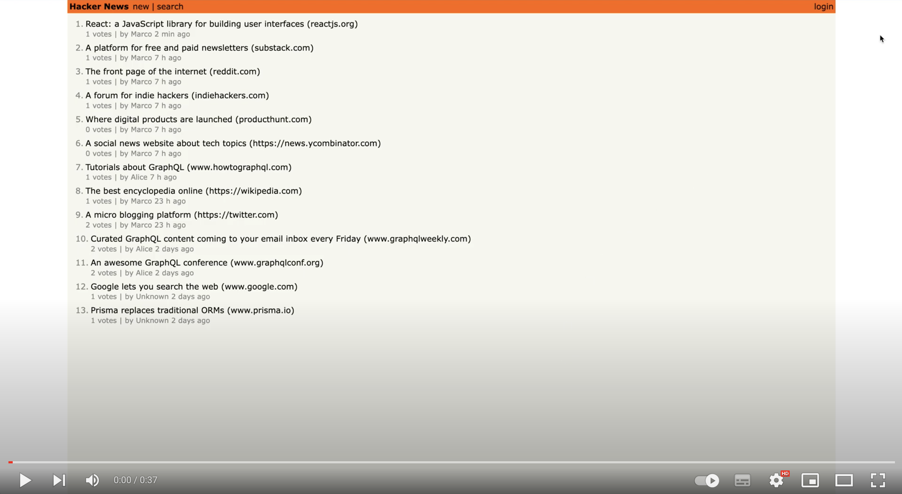

# Hackernews clone

A clone of [hackernews](https://en.wikipedia.org/wiki/Hacker_News) built with React, Node.js and GraphQL following the tutorials on https://howtographql.com

[](https://youtu.be/blVzWzKdY6M "Video")


## Technologies

Built with the following technlogies and libraries

- [React](https://reactjs.org/)
- [Node.js](https://nodejs.org/)
- [GraphQL](https://www.graphql.com/)
- [Prisma](https://www.prisma.io/)
- [SQLite](https://sqlite.org/)
- [Apollo server](https://www.apollographql.com/)
- [React router](https://reactrouter.com/)


## Features

- [x] Users can signup, login and logout
- [x] Usars can post a new link
- [x] Users can upvote a link
- [x] Users can see the posted links
- [x] Users can search links with specific terms
- [x] When a link is created or upvoted all users present on the website will get the updated data in real time

## Installation

1. **Clone the project**

```
 git clone https://github.com/marconunnari/hackernews-clone
 cd hackernews-clone
```

2. **Install and run the backend (http://localhost:4000)**
```
cd backend
yarn
yarn prisma migrate dev
yarn start
```

3. **Install and run the frontend  (http://localhost:3000)**
```
cd frontend
yarn
yarn start
```
